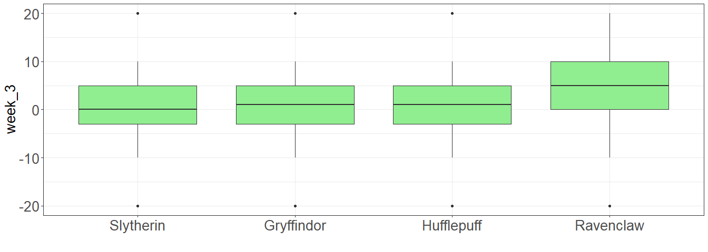

Основы визуализации на R
================
Касьянова Мария
2024-09-28

# Чтение данных и предобработка

``` r
hogwarts <- read_csv("data/hogwarts_2024.csv")

hogwarts <- hogwarts |> mutate(
  across(c(house, course, sex, wandCore, bloodStatus), ~ as.factor(.x)))
```

# Столбчатые диаграммы

## 1.Распределение по курсам

Построим барплот, отражающий число студентов на каждом курсе:

``` r
theme_custom <- theme(
    axis.text = element_text(size = 20),
    axis.title = element_text(size = 20),
    legend.title = element_text(size = 20),
    legend.text = element_text(size = 20),
    plot.title = element_text(size = 25, hjust = 0.5),
    plot.subtitle = element_text(size = 20, hjust = 0.5),
    plot.caption = element_text(size = 20)
  )

ggplot(hogwarts)+
  geom_bar(aes(x = course), fill = "gold", colour = "midnightblue")+ 
  theme_minimal()+
  theme_custom
```

<!-- -->

## 2.Факультет и происхождение

Теперь отразим на графике, какую долю каждого курса занимает
определенная группа волшебников (маглорожденные, полукровки и
чистокровные).

``` r
ggplot(hogwarts)+
  geom_bar(aes(x = house, 
               fill = bloodStatus), 
           colour = "midnightblue", 
           position = "fill"
           )+ 
  theme_classic()+
  theme_custom
```

<!-- --> Пожалуй,
основной вывод, который можно сделать из графика: среди волшебников на
всех факультетах с большим отрывом преобладают полукровки, а
маглорожденных меньше всего. Без применения дополнительных тестов из
графика неочевидно, различаются ли значимо доли на разных факультетах
или это просто погрешность (но скорее всего отличия будут на
гриффиндоре).

## 3.Маглорожденные vs чистокровные

На графике ниже изображено соотношение учеников с двумя родителями
маглами или волшебниками (без учета полукровок).

``` r
hogwarts %>% 
  filter(bloodStatus != "half-blood") %>% 
  ggplot()+
  geom_bar(aes(x = house, 
               fill = bloodStatus), 
           colour = "midnightblue", 
           position = "fill"
           )+ 
  geom_hline(yintercept = 0.5, 
             linetype = "dashed", 
             colour = "midnightblue",
             size = 2)+
  labs(x = "Факультет",
       y = "Доля среди не полукровок",
       fill = "Происхождение")+
  scale_fill_discrete(labels = c("Маглорожденные", "Чистокровные"))+
  scale_x_discrete(labels = c("Гриффиндор", "Пуффендуй", "Когтевран", "Слизерин"))+
  theme_bw()+
  theme_custom
```

<!-- -->

Видно, что на всех факультетах чистокровных больше, чем маглорожденных

# Боксплоты

## 1.Третья неделя

Покажем, какаие оценки заработали ученики разных факультетов за третью
неделю:

``` r
hogwarts |> 
  ggplot(aes(y = week_3,
             x = fct_reorder(house, week_3)))+
  geom_boxplot(fill = "lightgreen")+
  labs(x = "")+
  theme_bw()+
  theme_custom
```

<!-- -->

## 2.Зависимость от происхождения

``` r
hogwarts |> 
  ggplot(aes(y = week_3,
             x = fct_reorder(house, week_3),
             fill = bloodStatus))+
  geom_boxplot(notch = TRUE)+
  labs(x = "Факультет",
       y = "Оценки на 3 неделе",
       fill = "Происхождение")+
  scale_fill_discrete(labels = c("Полукровки", "Маглорожденные", "Чистокровные"))+
  scale_x_discrete(labels = c("Слизерин", "Гриффиндор", "Пуффендуй", "Когтевран"))+
  theme_bw()+
  theme_custom
```

<!-- -->

## 3. Немного добавок

``` r
hogwarts |> 
  ggplot(aes(y = week_3,
             x = fct_reorder(house, week_3),
             fill = bloodStatus))+
  geom_boxplot(notch = TRUE, 
               outlier.shape = NA,
               width = .4, 
               linewidth = 1)+
  geom_jitter(color = "grey35",
              alpha = .5
              )+
  labs(x = "",
       y = "",
       fill = "Происхождение",
       title = "Оценки на 3 неделе...",
       subtitle = "... в зависимости от факультета и происхождения",
       caption = "маглорожденные на когтевране топ")+
  scale_fill_discrete(labels = c("Полукровки", "Маглорожденные", "Чистокровные"))+
  scale_x_discrete(labels = c("Слизерин", "Гриффиндор", "Пуффендуй", "Когтевран"))+
  theme_bw()+
  theme_custom
```

    ## Warning: Ignoring unknown parameters: linewidth

<!-- -->

# Разное

## 1.Успехи 5 курса

“Леденцовый график” для изображения результатов экзамена:

``` r
hogwarts |> 
  filter(course  == 5) |> 
  mutate(id = as.factor(id)) |> 
  ggplot()+
  geom_segment(aes(x = fct_reorder(id, - result), 
                   xend = fct_reorder(id, - result), 
                   y = 0, 
                   yend = result))+
  geom_point(aes(x = fct_reorder(id, result), 
                 y = result,
                 colour = wandCore), 
             size = 3)+
  scale_color_manual(values = c("dragon heartstring" = "red", 
                                "phoenix feather" = "yellow", 
                                "unicorn hair" = "grey"))+
  labs(x = "id",
       y = "Score")+
  theme_bw()+
  theme_custom+
  theme(axis.text.x =  element_text(size = 5))
```

<!-- -->

## 2.Астрономия

``` r
hogwarts |> 
  ggplot()+
  geom_histogram(aes(x = `Astronomy exam`, fill = (house == "Slytherin")),
                 alpha = .75)+
  theme_bw()+
  labs(y = "Number of students")+
  scale_fill_manual(name = "House", labels = c("Not Slytherin", "Slytherin"), values = c("firebrick3", "midnightblue"))+
  theme(axis.text = element_text(size = 18),
    axis.title.y = element_text(size = 20),
    axis.title.x = element_text(size = 22),
    legend.title = element_text(size = 20),
    legend.text = element_text(size = 18)
    )
```

<!-- -->

## 3.Новая тема

``` r
theme_custom <- theme(
    axis.text = element_text(size = 20),
    axis.title = element_text(size = 20),
    legend.title = element_text(size = 20),
    legend.text = element_text(size = 20),
    plot.title = element_text(size = 25, hjust = 0.5),
    plot.subtitle = element_text(size = 20, hjust = 0.5),
    plot.caption = element_text(size = 20),
    panel.background = element_rect(fill = "white")
  )

hogwarts |> 
  ggplot(aes(y = week_3,
             x = fct_reorder(house, week_3),
             fill = bloodStatus))+
  geom_boxplot(notch = TRUE, 
               outlier.shape = NA,
               width = .4, 
               linewidth = 10)+
  geom_jitter(color = "grey35",
              alpha = .5
              )+
  labs(x = "",
       y = "",
       fill = "Происхождение",
       title = "Оценки на 3 неделе...",
       subtitle = "... в зависимости от факультета и происхождения",
       caption = "маглорожденные на когтевране топ")+
  scale_fill_discrete(labels = c("Полукровки", "Маглорожденные", "Чистокровные"))+
  scale_x_discrete(labels = c("Слизерин", "Гриффиндор", "Пуффендуй", "Когтевран"))+
  theme_custom
```

    ## Warning: Ignoring unknown parameters: linewidth

<!-- -->

# Фасетирование

## 1.Лучший способ

Мне кажется, что гистограммы лучше разбивать по строкам, чтобы было
легче зрительно сравнивать статистики вроде минимума, максимума,
медианы, дисперсии и тд. Поскольку при разбиении по строкам у нас
выравнивается ось Х и графики располагаются друг над другом, становится
легко отследить, какое распределение сдвинуто вправо или влево, у какого
больше разброс значений, тяжелее один из хвостов и тд. А для
violin-plot, соответственно, лучше фасетировать по столбцам (чтобы
графики располагались подряд слева направо), поскольку перечисленные
мной статистики на нем откладываются по оси Y. Общее правило: нужно
фасетировать так, чтобы ось, по которой откладываются интересующие нас
значения или различия, была общей.

## 2. Защита от темных искусств

``` r
ggplot(hogwarts)+
  geom_histogram(aes(x = `Defence against the dark arts exam`), 
                 fill = "gold", 
                 colour = "midnightblue",
                 bins = 10
                )+ 
  #facet_grid(course~.)+
  facet_wrap(vars(course))+
  labs(x = "",
       y = "",
       title = "Распределение оценок по предмету 'Защита от темных искусств' в зависимости от курса")+
  theme_custom+
  theme (strip.text = element_text(size = 20),
         plot.title = element_text(size = 20))
```

<!-- -->

## 3.Темные искусства vs Травология

``` r
hogwarts |> 
  select(id, sex, `Herbology exam`, `Defence against the dark arts exam`) |> 
  pivot_longer(! c(id,sex),
               names_to = "exam", 
               values_to = "score") |> 
  ggplot()+
  geom_density(aes(x = score, fill = exam),
               alpha=.5)+ 
  scale_fill_manual(values=c("blue","red"))+
  facet_wrap(vars(sex))+
  theme_custom+
  theme (strip.text = element_text(size = 20))
```

<!-- -->
