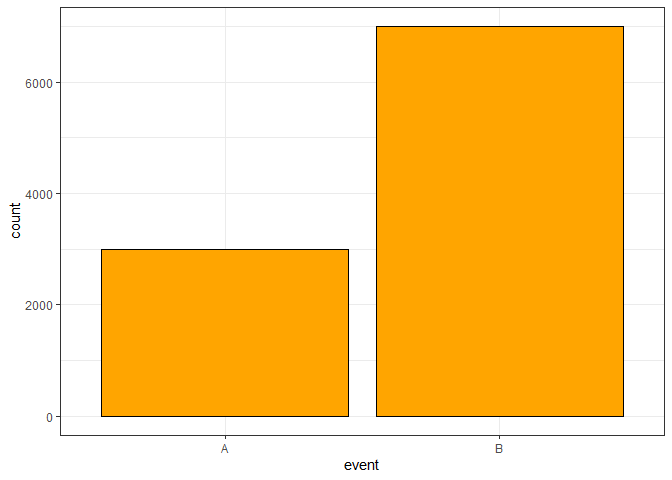
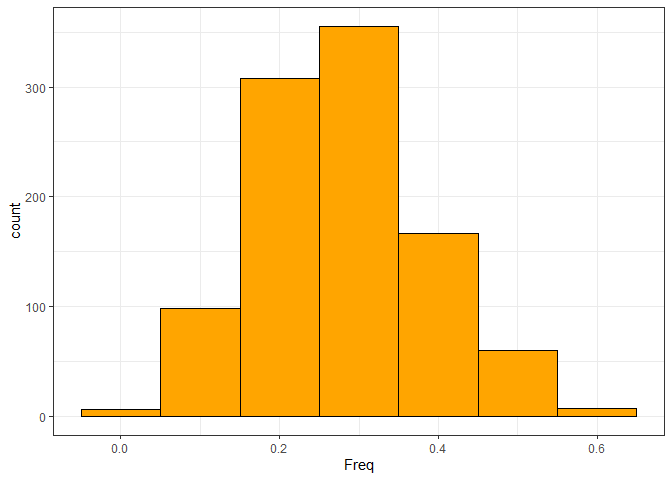
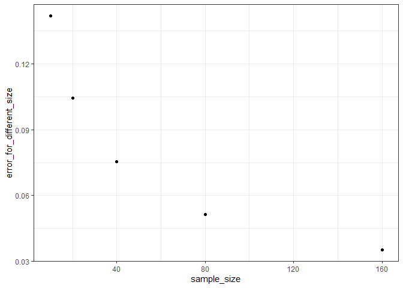
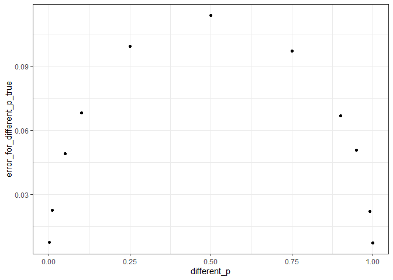

Ошибка вычисления доли
================
Kасьянова Мария
2024-10-08

## Модель пациента: исследование доли выживших

Сгенерируем “генеральную совокупность”, в которой с частотами *p_true* и
*1 - p_true* происходят события А (полное выздоровление) или В (неполное
выздоровление или смерть).

``` r
p_true <- 0.3
event <- c(rep("A",times=round(p_true*10000)), rep("B",times=10000 - round(p_true*10000)))
general <- data.frame(event)

ggplot(general, aes(x=event)) +
  geom_histogram(stat="count", fill = "orange", color = "black") + 
  theme_bw()
```

<!-- -->

## Однократная оценка по выборке

Наше исследование генеральной совокупности выглядело бы следующим
образом: берем нескольких подопытных и считаем, какая доля из них
выздоровела. (*replace = T* имитирует бесконечную генеральную
совокупность, в которой после исключения одного человека, не меняются
вероятности событий А и В)

``` r
n_patients <- 20 # Количество добровольцев 
my_sample <- sample(general$event, n_patients, replace=T)
p_sample <- nrow(subset(data.frame(my_sample),my_sample== "A"))/n_patients

print(p_sample)
```

    ## [1] 0.25

## Набираем статистику

Но, в прошлый раз нам могло повезти (или не повезти), поэтому повторим
исследование много раз и возьмем среднее по всем оценкам:

``` r
n_patients <- 20 # Количество добровольцев 

n_repeats <- 1000 # Количество повторений эксперимента

rep_sample <- c()

for(i in 1:n_repeats){
  rep_sample <- c(rep_sample, sample(general$event, n_patients, replace=T))  
}

df_all_repeats <- data.frame(
  n_exp = rep(1:n_repeats, each = n_patients),
  rep_sample
)

df_sample_mean <- data.frame(table(df_all_repeats))[1:n_repeats, ]

df_sample_mean$Freq <- df_sample_mean$Freq/n_patients

mean(df_sample_mean$Freq)
```

    ## [1] 0.30375

Также можем посмотреть на распределение наших оценок:

``` r
ggplot(df_sample_mean, aes(x = Freq)) +
  geom_histogram(color = 'black', fill = 'orange', binwidth = 0.1) +
  theme_bw()
```

<!-- -->

## Количественные и качественные итоги

Наконец, мы можем вычислить размер ошибки (отклонения от истинного
значения)

``` r
error <- sqrt( mean((df_sample_mean$Freq-p_true)^2) )
print(error)
```

    ## [1] 0.1059363

## Зависимость от размера выборки

Теперь посмотрим, как меняется ошибка в зависимости от размера выборки:

``` r
n_repeats <- 1000 
sample_size <- c(10, 20, 40, 80, 160)
error_for_different_size <- c()

for (i in sample_size){
  n_patients <- i 
  rep_sample <- c()

  for(i in 1:n_repeats){
    rep_sample <- c(rep_sample, sample(general$event, n_patients, replace=T))  
  }

  df_all_repeats <- data.frame(n_exp = rep(1:n_repeats, each = n_patients),
                               rep_sample)

  df_sample_mean <- data.frame(table(df_all_repeats))[1:n_repeats, ]

  df_sample_mean$Freq <- df_sample_mean$Freq/n_patients

  error_for_different_size <- c(error_for_different_size, sqrt( mean((df_sample_mean$Freq-p_true)^2)))
}

df <- data.frame(sample_size, error_for_different_size)

ggplot(df, aes(x = sample_size, y = error_for_different_size))+
  geom_point()+
  theme_bw()
```

<!-- -->

Несложно заметить, что чем больше размер выборки, тем меньше ошибка,
причем убывает она нелинейно.

## Зависимость от истинной вероятности

Осталось узнать, как меняется ошибка в зависимости от истинной
вероятности события А:

``` r
different_p <- c(0.001, 0.01, 0.05, 0.1, 0.25, 0.5, 0.75, 0.9, 0.95, 0.99, 0.999)
n_repeats <- 1000 
n_patients <- 20
error_for_different_p_true <- c()

for (i in different_p){
  p_true <- i
  event <- c(rep("A",times=round(p_true*10000)), rep("B",times=10000 - round(p_true*10000)))
  general <- data.frame(event)
  rep_sample <- c()

  for(i in 1:n_repeats){
    rep_sample <- c(rep_sample, sample(general$event, n_patients, replace=T))  
  }

  df_all_repeats <- data.frame(n_exp = rep(1:n_repeats, each = n_patients),
                               rep_sample)

  df_sample_mean <- data.frame(table(df_all_repeats))[1:n_repeats, ]
  df_sample_mean$Freq <- df_sample_mean$Freq/n_patients
  error_for_different_p_true <- c(error_for_different_p_true, sqrt( mean((df_sample_mean$Freq-p_true)^2)))
}

df <- data.frame(different_p, error_for_different_p_true)

ggplot(df, aes(x = different_p, y = error_for_different_p_true))+
  geom_point()+
  theme_bw()
```

<!-- -->

На этот раз ошибка больше в том случае, когда оба события А и В
происходят часто (если какое-то из этих событий очень редкое, то ошибка
уменьшается)
