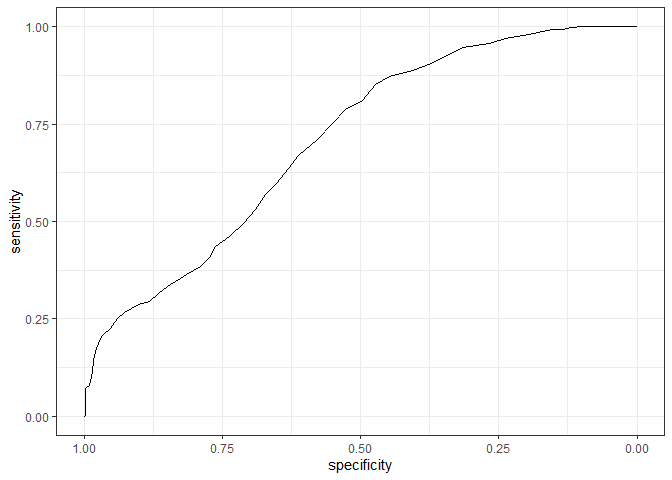
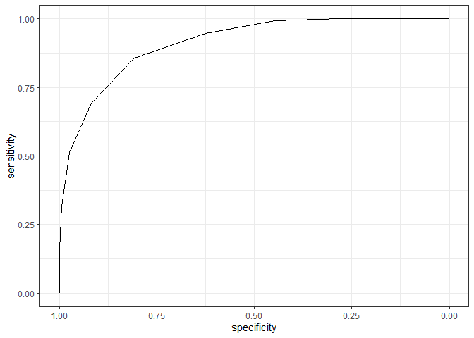

Особенности медицинских данных
================
Касьянова Мария
2024-10-15

## Загрузка данных

Предварительный просмотр таблицы в exсel показал, что:

- при записи роста использовалось не число, а строка с дополнительными
  символами
- в графе Hb встречалось значение 0, хотя гемоглобин не может
  отсутсвовать в крови живого человека, так что скорее всего эту запись
  использовали, когда тест вообще не проводился, то есть корректное
  значение в строках с 0 - это NA
- смерть обозначалась числами 0 или 1, данную колонку необходимо сделать
  фактором, так как это не количественная переменная
- пол тоже должен быть фактором
- можно перевести рост в м, а вес в кг, чтобы было легче
  интерпретировать данные

Исправим все перечисленное

``` r
trauma_data <- read_excel("trauma.xlsx")

trauma_data<- trauma_data %>%
  mutate(Height = as.numeric(str_remove(Height, '"'))*2.54/100,
         Weight = Weight/2.2,
         across(c(id, Death, Sex), ~ as.factor(.x)),
         Hb = na_if(Hb, 0))
```

Теперь таблица выглядит правильно, что подстверждают описательные
статистики для всех переменных:

``` r
trauma_data %>% summary()
```

    ##        id           Name               Sex           Age            Height     
    ##  1      :   1   Length:1024        Female:384   Min.   :18.00   Min.   :1.621  
    ##  2      :   1   Class :character   Male  :640   1st Qu.:29.00   1st Qu.:1.770  
    ##  3      :   1   Mode  :character                Median :41.00   Median :1.849  
    ##  4      :   1                                   Mean   :40.94   Mean   :1.840  
    ##  5      :   1                                   3rd Qu.:53.00   3rd Qu.:1.908  
    ##  6      :   1                                   Max.   :64.00   Max.   :2.029  
    ##  (Other):1018                                                                  
    ##      Weight            SBP             DBP              FOUR       
    ##  Min.   : 60.59   Min.   : 90.0   Min.   : 58.00   Min.   : 0.000  
    ##  1st Qu.: 82.58   1st Qu.:106.0   1st Qu.: 78.00   1st Qu.: 7.000  
    ##  Median : 88.14   Median :110.0   Median : 84.00   Median : 9.000  
    ##  Mean   : 87.97   Mean   :110.8   Mean   : 84.78   Mean   : 8.853  
    ##  3rd Qu.: 93.38   3rd Qu.:116.0   3rd Qu.: 90.00   3rd Qu.:11.000  
    ##  Max.   :115.05   Max.   :134.0   Max.   :110.00   Max.   :16.000  
    ##                                                                    
    ##       GSC               Hb        Death  
    ##  Min.   : 3.000   Min.   : 9.40   0:615  
    ##  1st Qu.: 6.000   1st Qu.:12.10   1:409  
    ##  Median : 8.000   Median :13.10          
    ##  Mean   : 7.785   Mean   :13.01          
    ##  3rd Qu.:10.000   3rd Qu.:14.00          
    ##  Max.   :14.000   Max.   :16.20          
    ##                   NA's   :16

Доболнительно узнаем, у какого количества и процента пациентов был
снижен гемоглобин, используя следующие референтные значения:

- Мужчины: 13.5–16 г/дл
- Женщины: 12–14 г/дл

``` r
small_hb_count<- trauma_data %>%
  subset((Sex == "Female" & Hb <12)|(Sex == "Male" & Hb < 13.5))%>%
  nrow()


print(str_c("Количество людей со сниженным гемоглобином равно ", small_hb_count, "."))
```

    ## [1] "Количество людей со сниженным гемоглобином равно 458."

``` r
print(str_c("Это ", sprintf("%.1f", small_hb_count/nrow(trauma_data)*100), "%."))
```

    ## [1] "Это 44.7%."

## Ожирение

Добавим колонку с индексом массы тела у пациентов (кг / м2).

``` r
trauma_data <- trauma_data %>%
  mutate(BMI = (Weight / Height / Height)%>% round(1))

mean_BMI <- mean(trauma_data$BMI)%>% round(1)
SD_BMI <- sd(trauma_data$BMI)%>% round(1)

print(str_c("Средний индекс массы тела (М) -  ", mean_BMI, "кг/м2, стандартное отклонение (SD) равно ", SD_BMI, "."))
```

    ## [1] "Средний индекс массы тела (М) -  26.1кг/м2, стандартное отклонение (SD) равно 2.6."

``` r
big_BMI_count<- trauma_data %>%
  subset(BMI >30)%>%
  nrow()

print(str_c("Доля пациентов с ожирением составила ", round(big_BMI_count/nrow(trauma_data)*100, 1), "%."))
```

    ## [1] "Доля пациентов с ожирением составила 6.8%."

# Анализ ROC-кривых

Проведём ROC-анализ для предсказания летального исхода по переменной,
характеризующей уровень гемоглобина:

``` r
roc_curve_1 <- roc(Death ~ Hb, 
                   data = trauma_data,
                   ci = T)
roc_curve_1 %>% 
    ggroc() + 
    theme_bw()
```

<!-- -->

Эта ROC кривая явно выше диагонали, но имеет не совсем обычно изогнутую
форму (недостаточно выпуклую, в середине похожа на прямую, а по краям
резкие перепады). Скорее всего это связано с тем, что экстремальные
значения гемоглобина ассоциированны со смертностью сильнее, чем средние
(грубо говоря, все, у кого гемоглобин очень маленький, умирали, а у кого
очень большой - выживали, в то время как люди со средним гемоглобином не
имели четкой закономерности в выживаемости).

``` r
roc_curve_1
```

    ## 
    ## Call:
    ## roc.formula(formula = Death ~ Hb, data = trauma_data, ci = T)
    ## 
    ## Data: Hb in 605 controls (Death 0) > 403 cases (Death 1).
    ## Area under the curve: 0.7078
    ## 95% CI: 0.6763-0.7392 (DeLong)

Площадь под кривой составляет 0.7078 (95% двусторонний доверительный
интервал: 0.6763-0.7392)

# Предсказание по шкале комы Глазго

Проведем аналогичные рассчеты для предсказания сметрности по шкале
Глазго

``` r
roc_curve_2 <- roc(Death ~ GSC, 
                   data = trauma_data,
                   ci = T)

roc_curve_2 %>% 
    ggroc() + 
    theme_bw()
```

<!-- -->

``` r
roc_curve_2 
```

    ## 
    ## Call:
    ## roc.formula(formula = Death ~ GSC, data = trauma_data, ci = T)
    ## 
    ## Data: GSC in 615 controls (Death 0) > 409 cases (Death 1).
    ## Area under the curve: 0.9124
    ## 95% CI: 0.8959-0.9289 (DeLong)

На этот раз площадь под кривой равна 0.9124 (ДИ: 0.8959-0.9289). Можно
выбрать оптимальный порог для предсказания: он сотавил 7.5, при нем
специфичность равна 0.81, а чувствительность - 0.86.

``` r
roc_curve_2 %>% coords(x = "best", best.method = "closest.topleft")
```

    ##   threshold specificity sensitivity
    ## 1       7.5   0.8081301   0.8557457

## Что лучше использовать для предсказания?

Протестируем все количественные переменные по предсказательной силе:

``` r
trauma_data %>% 
    select("Death",
           "Age",
           "Height",
           "Weight",
           "BMI",
           "SBP",
           "DBP",
           "FOUR",
           "GSC",
           "Hb") %>% 
    pivot_longer(cols = !Death, names_to = "name") %>% 
    group_by(name) %>% 
    summarise(AUC = roc(Death, value, ci = T)$ci[2] %>% round(3),
              AUC_LCL = roc(Death, value, ci = T)$ci[1] %>% round(3),
              AUC_UCL = roc(Death, value, ci = T)$ci[3] %>% round(3))%>%
  arrange(AUC)
```

    ## # A tibble: 9 x 4
    ##   name     AUC AUC_LCL AUC_UCL
    ##   <chr>  <dbl>   <dbl>   <dbl>
    ## 1 Height 0.482   0.445   0.518
    ## 2 BMI    0.499   0.462   0.535
    ## 3 Weight 0.518   0.482   0.554
    ## 4 Age    0.527   0.491   0.563
    ## 5 Hb     0.708   0.676   0.739
    ## 6 DBP    0.744   0.714   0.774
    ## 7 SBP    0.786   0.759   0.814
    ## 8 GSC    0.912   0.896   0.929
    ## 9 FOUR   0.934   0.92    0.948

Наибольшей площадью под ROC кривой обладает переменная шкалы комы FOUR,
за ней идет шкала Глазго. То есть с наибольшей вероятностью предсказать
смерть в течение 24 часов после поступления позволят эти две шкалы
(лучше использовать FOUR). Также на предсказание может повлиять значение
систолического и диастолического артериального давления и уровень
гемоглобина, остальные переменные предсказательной силой не обладают
(доверительный интервал захватывает 0.5). Наименьшую площадь под кривой
имеет рост.
